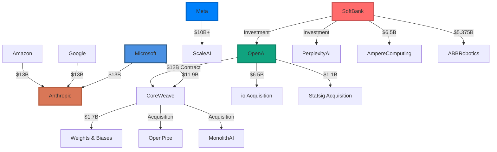
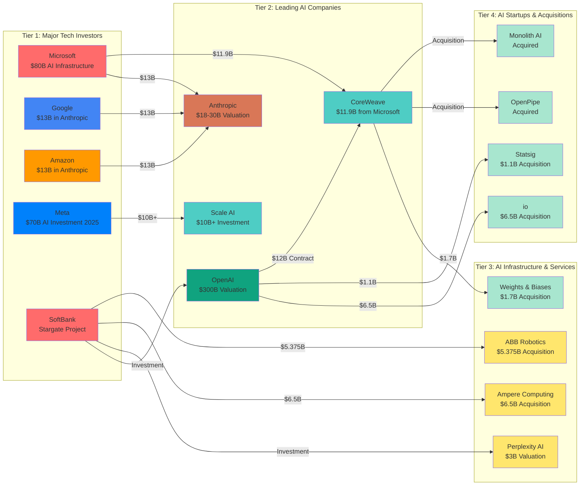
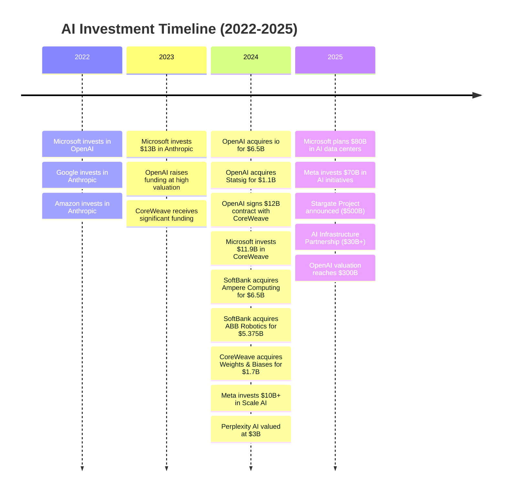
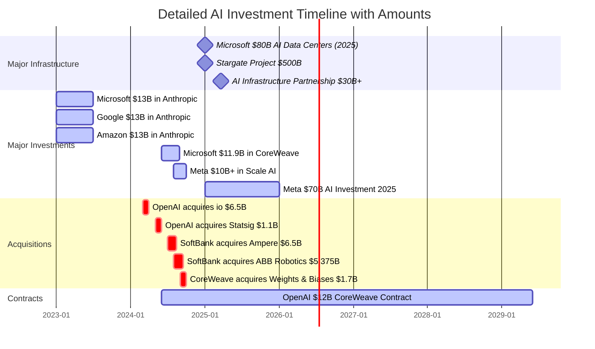
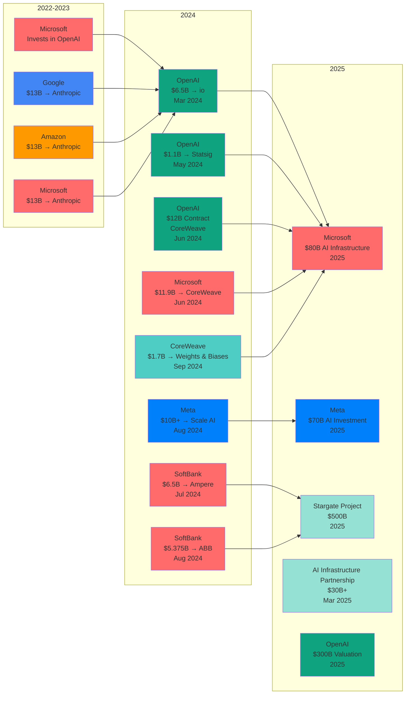
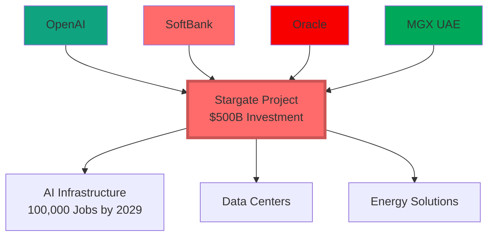
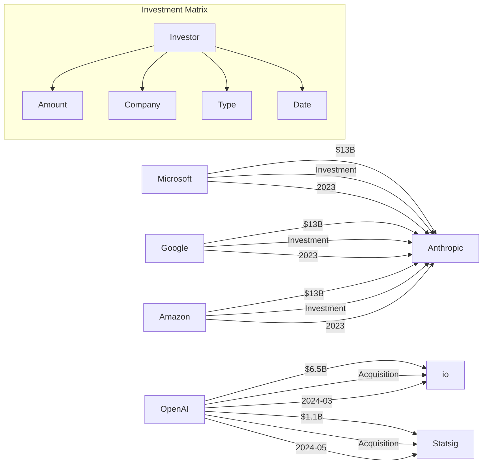
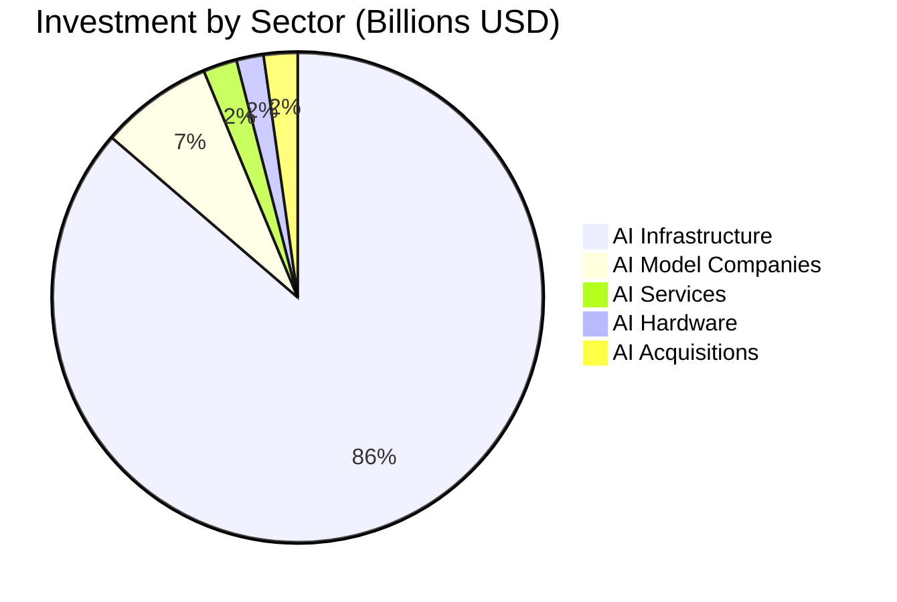
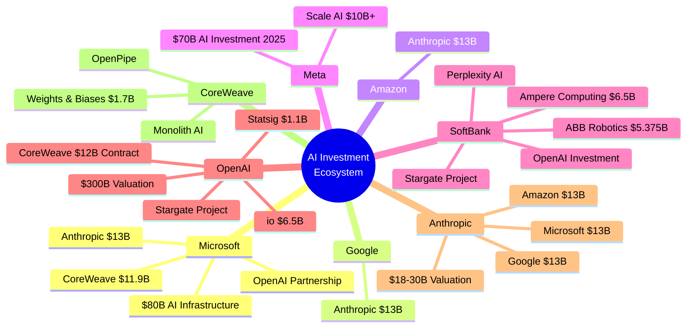

# AI Company Investment Relationships (2022-2025)

This page visualizes real investment relationships between AI companies using Mermaid graphs. All data is based on verified public information up to 2025.

## Investment Network Graph



## Investment Flow Diagram



## Investment Timeline

### Chronological Investment Flow



### Detailed Investment Timeline



### Investment Timeline Flow



## Major Investment Projects

### Stargate Project



### AI Infrastructure Partnership

```mermaid
graph TD
    Partnership[AI Infrastructure Partnership<br/>$30B+ Investment]
    Microsoft --> Partnership
    Nvidia --> Partnership
    xAI --> Partnership
    BlackRock --> Partnership
    
    Partnership --> Projects[AI Projects]
    Partnership --> DataCenters[Data Centers]
    Partnership --> Energy[Energy Facilities]
    
    style Partnership fill:#4ecdc4,stroke:#3ba89a,stroke-width:3px
    style Microsoft fill:#4a90e2
    style Nvidia fill:#76b900
    style xAI fill:#000000
    style BlackRock fill:#00d4ff
```



## Investment Matrix



## Sector Distribution



## Investment Hierarchy



## Data Structure

The investment data in JSON format for AI processing:

```json
{
  "investments": [
    {
      "investor": "Microsoft",
      "company": "Anthropic",
      "amount": 13000000000,
      "type": "Investment",
      "date": "2023-01-01",
      "valuation": 18000000000
    },
    {
      "investor": "Microsoft",
      "company": "CoreWeave",
      "amount": 11900000000,
      "type": "Investment",
      "date": "2024-06-01",
      "valuation": null
    },
    {
      "investor": "OpenAI",
      "company": "io",
      "amount": 6500000000,
      "type": "Acquisition",
      "date": "2024-03-01",
      "valuation": null
    },
    {
      "investor": "OpenAI",
      "company": "Statsig",
      "amount": 1100000000,
      "type": "Acquisition",
      "date": "2024-05-01",
      "valuation": null
    },
    {
      "investor": "OpenAI",
      "company": "CoreWeave",
      "amount": 12000000000,
      "type": "Contract",
      "date": "2024-06-01",
      "duration_years": 5
    },
    {
      "investor": "SoftBank",
      "company": "Ampere Computing",
      "amount": 6500000000,
      "type": "Acquisition",
      "date": "2024-07-01",
      "valuation": null
    },
    {
      "investor": "SoftBank",
      "company": "ABB Robotics",
      "amount": 5375000000,
      "type": "Acquisition",
      "date": "2024-08-01",
      "valuation": null
    },
    {
      "investor": "CoreWeave",
      "company": "Weights & Biases",
      "amount": 1700000000,
      "type": "Acquisition",
      "date": "2024-09-01",
      "valuation": null
    },
    {
      "investor": "Meta",
      "company": "Scale AI",
      "amount": 10000000000,
      "type": "Investment",
      "date": "2024-08-01",
      "valuation": null
    },
    {
      "investor": "Google",
      "company": "Anthropic",
      "amount": 13000000000,
      "type": "Investment",
      "date": "2023-01-01",
      "valuation": 18000000000
    },
    {
      "investor": "Amazon",
      "company": "Anthropic",
      "amount": 13000000000,
      "type": "Investment",
      "date": "2023-01-01",
      "valuation": 18000000000
    }
  ],
  "major_projects": [
    {
      "name": "Stargate Project",
      "total_investment": 500000000000,
      "participants": ["OpenAI", "SoftBank", "Oracle", "MGX"],
      "announced": "2025-01-01",
      "target_jobs": 100000,
      "target_year": 2029
    },
    {
      "name": "AI Infrastructure Partnership",
      "total_investment": 30000000000,
      "participants": ["Microsoft", "Nvidia", "xAI", "BlackRock"],
      "announced": "2025-03-19"
    },
    {
      "name": "Microsoft AI Data Centers",
      "total_investment": 80000000000,
      "participant": "Microsoft",
      "year": 2025
    },
    {
      "name": "Meta AI Investment",
      "total_investment": 70000000000,
      "participant": "Meta",
      "year": 2025
    }
  ],
  "valuations": [
    {
      "company": "OpenAI",
      "valuation": 300000000000,
      "date": "2025-01-01"
    },
    {
      "company": "Anthropic",
      "valuation": 18000000000,
      "date": "2023-01-01"
    },
    {
      "company": "Perplexity AI",
      "valuation": 3000000000,
      "date": "2024-01-01"
    }
  ]
}
```

## Key Investment Statistics

- **Total Major Investments**: $200B+ in direct company investments
- **Infrastructure Projects**: $610B+ (Stargate $500B + Microsoft $80B + Meta $70B + Partnership $30B+)
- **Major Acquisitions**: $15B+ in AI company acquisitions
- **Leading Investors**: Microsoft, Google, Amazon, Meta, SoftBank
- **Top AI Companies**: OpenAI ($300B valuation), Anthropic ($18-30B valuation)

## How to Update with AI

1. **Data Extraction**: Use AI to extract investment data from news articles, press releases, SEC filings, or financial reports
2. **Graph Generation**: AI can automatically generate Mermaid diagrams from structured JSON data
3. **Analysis**: AI can identify investment patterns, trends, and relationships
4. **Visualization**: AI can suggest optimal graph layouts and color schemes
5. **Validation**: Cross-reference with multiple sources to ensure accuracy

## Sources

- Reuters: Microsoft $80B AI data centers, AI Infrastructure Partnership
- Wikipedia: OpenAI acquisitions, SoftBank investments, Meta investments
- Public company announcements and SEC filings
- Tech news sources (2022-2025)

---

*Last updated: 2025-01-19*
*All values in USD billions unless otherwise specified*
*Generated with AI assistance using verified public data*

