# AI Company Investment Relationships (2022-2025)

This page visualizes real investment relationships between AI companies using Mermaid graphs. All data is based on verified public information up to 2025.

## Investment Network Graph


## Investment Flow Diagram


## Investment Timeline

### Chronological Investment Flow


### Detailed Investment Timeline


### Investment Timeline Flow


## Major Investment Projects

### Stargate Project


### AI Infrastructure Partnership


## Investment Matrix


## Sector Distribution


## Investment Hierarchy


## Data Structure

The investment data in JSON format for AI processing:

```json
{
  "investments": [
    {
      "investor": "Microsoft",
      "company": "Anthropic",
      "amount": 13000000000,
      "type": "Investment",
      "date": "2023-01-01",
      "valuation": 18000000000
    },
    {
      "investor": "Microsoft",
      "company": "CoreWeave",
      "amount": 11900000000,
      "type": "Investment",
      "date": "2024-06-01",
      "valuation": null
    },
    {
      "investor": "OpenAI",
      "company": "io",
      "amount": 6500000000,
      "type": "Acquisition",
      "date": "2024-03-01",
      "valuation": null
    },
    {
      "investor": "OpenAI",
      "company": "Statsig",
      "amount": 1100000000,
      "type": "Acquisition",
      "date": "2024-05-01",
      "valuation": null
    },
    {
      "investor": "OpenAI",
      "company": "CoreWeave",
      "amount": 12000000000,
      "type": "Contract",
      "date": "2024-06-01",
      "duration_years": 5
    },
    {
      "investor": "SoftBank",
      "company": "Ampere Computing",
      "amount": 6500000000,
      "type": "Acquisition",
      "date": "2024-07-01",
      "valuation": null
    },
    {
      "investor": "SoftBank",
      "company": "ABB Robotics",
      "amount": 5375000000,
      "type": "Acquisition",
      "date": "2024-08-01",
      "valuation": null
    },
    {
      "investor": "CoreWeave",
      "company": "Weights & Biases",
      "amount": 1700000000,
      "type": "Acquisition",
      "date": "2024-09-01",
      "valuation": null
    },
    {
      "investor": "Meta",
      "company": "Scale AI",
      "amount": 10000000000,
      "type": "Investment",
      "date": "2024-08-01",
      "valuation": null
    },
    {
      "investor": "Google",
      "company": "Anthropic",
      "amount": 13000000000,
      "type": "Investment",
      "date": "2023-01-01",
      "valuation": 18000000000
    },
    {
      "investor": "Amazon",
      "company": "Anthropic",
      "amount": 13000000000,
      "type": "Investment",
      "date": "2023-01-01",
      "valuation": 18000000000
    }
  ],
  "major_projects": [
    {
      "name": "Stargate Project",
      "total_investment": 500000000000,
      "participants": ["OpenAI", "SoftBank", "Oracle", "MGX"],
      "announced": "2025-01-01",
      "target_jobs": 100000,
      "target_year": 2029
    },
    {
      "name": "AI Infrastructure Partnership",
      "total_investment": 30000000000,
      "participants": ["Microsoft", "Nvidia", "xAI", "BlackRock"],
      "announced": "2025-03-19"
    },
    {
      "name": "Microsoft AI Data Centers",
      "total_investment": 80000000000,
      "participant": "Microsoft",
      "year": 2025
    },
    {
      "name": "Meta AI Investment",
      "total_investment": 70000000000,
      "participant": "Meta",
      "year": 2025
    }
  ],
  "valuations": [
    {
      "company": "OpenAI",
      "valuation": 300000000000,
      "date": "2025-01-01"
    },
    {
      "company": "Anthropic",
      "valuation": 18000000000,
      "date": "2023-01-01"
    },
    {
      "company": "Perplexity AI",
      "valuation": 3000000000,
      "date": "2024-01-01"
    }
  ]
}
```

## Key Investment Statistics

- **Total Major Investments**: $200B+ in direct company investments
- **Infrastructure Projects**: $610B+ (Stargate $500B + Microsoft $80B + Meta $70B + Partnership $30B+)
- **Major Acquisitions**: $15B+ in AI company acquisitions
- **Leading Investors**: Microsoft, Google, Amazon, Meta, SoftBank
- **Top AI Companies**: OpenAI ($300B valuation), Anthropic ($18-30B valuation)

## Investment Risks and Concerns

### Financial Performance Issues


### Key Problems Identified

1. **Poor Return on Investment (ROI)**
   - **95% of organizations** report no return on AI investments (MIT Media Lab, 2025)
   - Despite $40 billion invested in generative AI, most companies see no measurable profitability impact
   - AI tools boost individual productivity but fail to improve overall company profitability

2. **Financial Losses**
   - **EY Survey (2025)**: Nearly all large firms deploying AI experienced initial financial losses totaling **$4.4 billion**
   - Losses due to: compliance failures, flawed outputs, bias, sustainability goal disruptions
   - **Microsoft**: Reportedly hiding **$4.7 billion loss** from OpenAI dealings under "other expenses"

3. **AI Investment Bubble Concerns**
   - **Bank of England & IMF warnings**: Potential investment bubble with "stretched" equity valuations
   - Market volatility: Nvidia shares dropped **17% in one day** (January 2025) following DeepSeek launch
   - S&P 500 companies with $20 trillion market cap have medium-to-high AI exposure risk

4. **Trust and Adoption Issues**
   - **61% of global businesses** scaling back AI investments due to trust issues (Qlik, 2024)
   - Factors: lack of skills, data governance challenges, insufficient resources
   - Many AI projects stalled or scrapped

5. **Partnership Strains**
   - **Microsoft-OpenAI partnership** reportedly strained (October 2025)
   - Concerns about transparency in financial reporting
   - Strategic alignment issues between partners

6. **Operational Challenges**
   - **Meta**: Laid off 600 employees in AI unit despite $10B+ investment in Scale AI
   - High development costs leading to financial mismanagement
   - Example: Builder.ai announced insolvency after $50M borrowing (May 2025)

7. **Regulatory and Legal Risks**
   - Antitrust concerns with major tech companies' AI investments
   - Legal challenges: Stability AI sued by Getty Images for copyright infringement
   - Regulatory scrutiny on foreign AI investments

8. **Energy and Infrastructure Concerns**
   - AI infrastructure projects increasing demands on power grids
   - Prolonged use of fossil fuel power plants
   - Environmental sustainability challenges

### Risk Timeline


### Investment Performance Comparison


## Visualizing the Investment Madness

### The Great Disconnect: Investment vs. Reality


### Investment Flow: Where the Money Goes vs. Where It Should Go


### The Investment Paradox: Scale vs. Success


### Risk vs. Reward Matrix


### The AI Investment Cycle of Madness

```mermaid
stateDiagram-v2
    [*] --> Hype: Massive Investment
    Hype --> Expectations: $810B+ Deployed
    Expectations --> Reality: 95% No ROI
    Reality --> Losses: $4.4B Lost
    Losses --> Concerns: Bubble Warnings
    Concerns --> ScalingBack: 61% Reduce Investment
    ScalingBack --> MoreInvestment: But Still Investing
    MoreInvestment --> Hype: Cycle Repeats
    
    note right of Hype
        FOMO Drives Investment
    end note
    
    note right of Reality
        Actual Results Don't Match
    end note
    
    note right of ScalingBack
        Yet Investment Continues
    end note
```



### Investment Efficiency: What You Get for Your Money


### The Contradiction Map


## How to Update with AI

1. **Data Extraction**: Use AI to extract investment data from news articles, press releases, SEC filings, or financial reports
2. **Graph Generation**: AI can automatically generate Mermaid diagrams from structured JSON data
3. **Analysis**: AI can identify investment patterns, trends, and relationships
4. **Visualization**: AI can suggest optimal graph layouts and color schemes
5. **Validation**: Cross-reference with multiple sources to ensure accuracy

## Sources

### Investment Data Sources
- Reuters: Microsoft $80B AI data centers, AI Infrastructure Partnership
- Wikipedia: OpenAI acquisitions, SoftBank investments, Meta investments
- Public company announcements and SEC filings
- Tech news sources (2022-2025)

### Risk and Problem Sources
- **Reuters** (Oct 2025): EY Survey on $4.4B AI deployment losses
- **AP News** (Oct 2025): Bank of England & IMF AI bubble warnings
- **MIT Media Lab** (2025): Study on 95% of organizations seeing no ROI
- **Windows Central** (Oct 2025): Microsoft $4.7B OpenAI loss reporting issues
- **Qlik** (Dec 2024): 61% of businesses scaling back AI investments
- **Scientific American**: AI investment fund underperformance
- **Wikipedia**: AI bubble concerns, Builder.ai insolvency, Stability AI legal issues
- **TechCrunch**: Investor caution on AI investments
- **S&P Global**: AI investment decline due to financing and IP concerns

---

*Last updated: 2025-01-19*
*All values in USD billions unless otherwise specified*
*Generated with AI assistance using verified public data*

